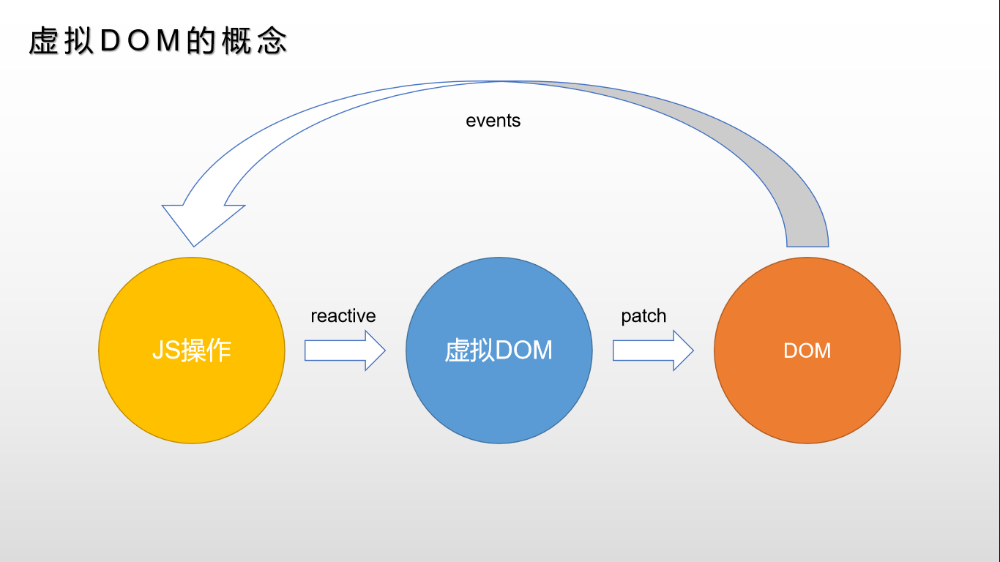
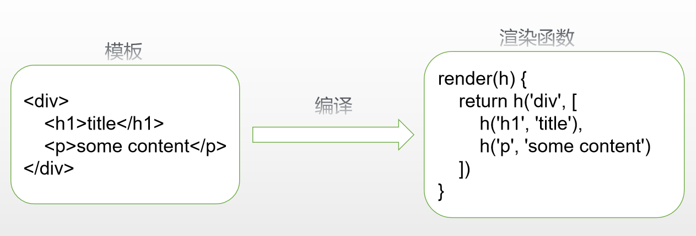
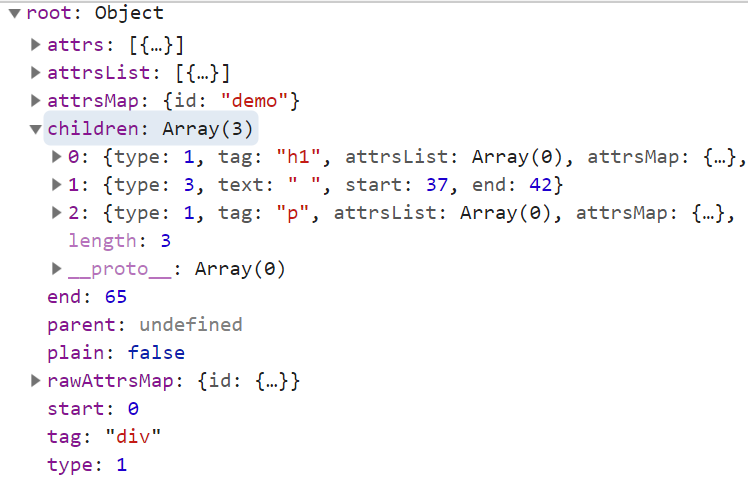
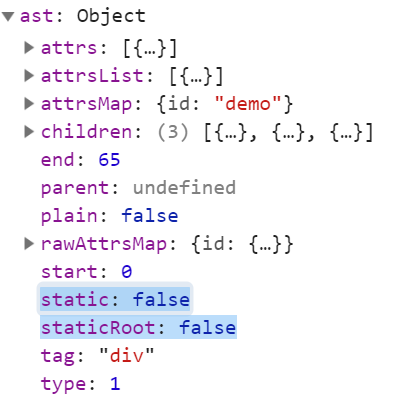

### 虚拟DOM

虚拟DOM（Virtual DOM）是对DOM的JS抽象表示，它们是JS对象，能够描述DOM结构和关系。




虚拟DOM流程

##### mountComponent

vdom树首页生成、渲染发生在mountComponent中，core/instance/lifecycle.js

```js
export function mountComponent (
  vm: Component,
  el: ?Element,
  hydrating?: boolean
): Component {
  // 挂载的宿主元素
  vm.$el = el
  
  // 调用beforeMount钩子
  callHook(vm, 'beforeMount')

  // 定义更新函数
  const updateComponent = () => {
      // 实际调用是在lifeCycleMixin中定义的_update和renderMixin中定义的_render
      vm._update(vm._render(), hydrating)
  }

  // 创建Watcher实例和根组件挂钩
  new Watcher(vm, updateComponent, noop, {
    before () {
      if (vm._isMounted && !vm._isDestroyed) {
        callHook(vm, 'beforeUpdate')
      }
    }
  }, true /* isRenderWatcher */)

  // 标识已挂载，调用mounted钩子
  // 子组件创建渲染时mounted会在它的inserted钩子中调用
  if (vm.$vnode == null) {
    vm._isMounted = true
    callHook(vm, 'mounted')
  }
  return vm
}
```


##### _render

_render生成虚拟dom，core/instance/render.js

```js
// 核心代码
Vue.prototype._render = function (): VNode {
    const vm: Component = this
    // 获取render，根组件往往是h => h(App)，子组件通常由template编译得到
    const { render, _parentVnode } = vm.$options

    // 保存parentVnode
    vm.$vnode = _parentVnode
    // 渲染当前组件Vnode
    let vnode
    try {
      currentRenderingInstance = vm
      // 关键代码：执行render，上下文是_renderProxy，参数为$createElement函数
      vnode = render.call(vm._renderProxy, vm.$createElement)
    } catch (e) {
      // ...
    } finally {
      currentRenderingInstance = null
    }
    // 一些特殊情况处理
    // ...
    // 设置父节点
    vnode.parent = _parentVnode
    return vnode
}
```


##### createElement

真正用来创建vnode的函数是createElement，src\core\vdom\create-element.js

```js
// 核心代码
export function createElement(...){
    //...
    return _createElement(...)
}
export function _createElement (
  context: Component,
  tag?: string | Class<Component> | Function | Object,
  data?: VNodeData,
  children?: any,
  normalizationType?: number
): VNode | Array<VNode> {
  // 结果
  let vnode, ns
  // 字符串tag：如“div"、”p“
  if (typeof tag === 'string') {
    let Ctor // 组件构造函数
    ns = (context.$vnode && context.$vnode.ns) || config.getTagNamespace(tag)
    if (config.isReservedTag(tag)) {
      // 原生标签
      vnode = new VNode(
        config.parsePlatformTagName(tag), data, children,
        undefined, undefined, context
      )
    } else if ((!data || !data.pre) && isDef(Ctor = resolveAsset(context.$options, 'components', tag))) {
      // 字符串形式表示的组件
      vnode = createComponent(Ctor, data, context, children, tag)
    } else {
      // 未知元素
      vnode = new VNode(
        tag, data, children,
        undefined, undefined, context
      )
    }
  } else {
    // 组件选项 / 构造函数
    vnode = createComponent(tag, data, context, children)
  }
  // 返回结果。。。
}

```


##### createComponent

用于创建组件并返回VNode，src\core\vdom\create-component.js

```js
export function createComponent (
  Ctor: Class<Component> | Function | Object | void,
  data: ?VNodeData,
  context: Component,
  children: ?Array<VNode>,
  tag?: string
): VNode | Array<VNode> | void {
  // 省略特殊判断...
  
  data = data || {}

  // 省略选项合并...

  // 提取props
  const propsData = extractPropsFromVNodeData(data, Ctor, tag)

  // 创建函数式组件
  if (isTrue(Ctor.options.functional)) {
    return createFunctionalComponent(Ctor, propsData, data, context, children)
  }

  // 提取listeners, 因为这些需要被子组件处理，替换为
  const listeners = data.on
  // 将data.on替换为带有.native修饰符的监听器，即data.nativeOn
  // 它会在父组件patch时被处理
  data.on = data.nativeOn

  if (isTrue(Ctor.options.abstract)) {
    // 抽象组件不保存props & listeners & slot以外东西
    const slot = data.slot
    data = {}
    if (slot) {
      data.slot = slot
    }
  }

  // 组件管理钩子合并，init/insert等
  installComponentHooks(data)

  // 返回占位vnode
  const name = Ctor.options.name || tag
  const vnode = new VNode(
    `vue-component-${Ctor.cid}${name ? `-${name}` : ''}`,
    data, undefined, undefined, undefined, context,
    { Ctor, propsData, listeners, tag, children },
    asyncFactory
  )

  return vnode
}
```


##### VNode

render返回的一个VNode实例，它的children还是VNode，最终构成一个树，就是虚拟DOM树，src\core\vdom\vnode.js

```js
// VNode对象：共有6种类型：元素、组件、函数式组件、文本、注释和克隆节点
export default class VNode {
  tag: string | void; // 节点标签，文本、注释没有
  data: VNodeData | void; // 节点数据，文本、注释没有
  children: ?Array<VNode>;// 元素子元素
  text: string | void;// 文本、注释的内容，元素文本
  elm: Node | void;
  ns: string | void;
  context: Component | void; 
  key: string | number | void;
  componentOptions: VNodeComponentOptions | void;
  componentInstance: Component | void; // 组件实例
  parent: VNode | void; 

  // strictly internal member...

}
```


##### _update

update负责更新dom，src\core\instance\lifecycle.js

```js
export function lifecycleMixin (Vue: Class<Component>) {
  Vue.prototype._update = function (vnode: VNode, hydrating?: boolean) {
    const vm: Component = this
    const prevEl = vm.$el
    const prevVnode = vm._vnode
    const restoreActiveInstance = setActiveInstance(vm)
    vm._vnode = vnode
    
    // ----核心代码-----
    if (!prevVnode) {
      // 若无prevVnode则是初始化渲染
      vm.$el = vm.__patch__(vm.$el, vnode, hydrating, false /* removeOnly */)
    } else {
      // 更新操作，diff发生在这里
      vm.$el = vm.__patch__(prevVnode, vnode)
    }
    restoreActiveInstance()
    // 关联dom上保存一个组件实例引用
    if (prevEl) {
      prevEl.__vue__ = null
    }
    if (vm.$el) {
      vm.$el.__vue__ = vm
    }
    // 若parent是一个HOC, 其$el也更新
    if (vm.$vnode && vm.$parent && vm.$vnode === vm.$parent._vnode) {
      vm.$parent.$el = vm.$el
    }
    // updated hook is called by the scheduler to ensure that children are
    // updated in a parent's updated hook.
  }
}

```

\__patch__是在平台特有代码中指定的， src/platforms/web/runtime/index.js

```js
Vue.prototype.__patch__ = inBrowser ? patch : noop
```

实际就是createPatchFunction的返回值，传递nodeOps和modules，这里主要是为了跨平台

```js
export const patch: Function = createPatchFunction({ nodeOps, modules })
```

src\platforms\web\runtime\node-ops.js定义各种原生dom基础操作方法

```js
import { namespaceMap } from 'web/util/index'

export function createElement (tagName: string, vnode: VNode): Element {
  const elm = document.createElement(tagName)
  if (tagName !== 'select') {
    return elm
  }
  // false or null will remove the attribute but undefined will not
  if (vnode.data && vnode.data.attrs && vnode.data.attrs.multiple !== undefined) {
    elm.setAttribute('multiple', 'multiple')
  }
  return elm
}
//...
```

`modules` 定义了虚拟dom更新 => dom操作转换方法

```js
// 平台特有模块，src\platforms\web\runtime\modules\index.js
export default [
  attrs,
  klass,
  events,
  domProps,
  style,
  transition
]
```


##### patch

patch将新老VNode节点进行比对（diff算法），然后根据比较结果进行最小量DOM操作，而不是将整个视图根据新的VNode重绘。


diff算法：通过**同层的树节点进行比较**而非对树进行逐层搜索遍历的方式，同层级只做三件事：增删改。具体规则是：new VNode不存在就删；old VNode不存在就增；都存在就比较类型，类型不同直接替换、类型相同执行更新；


```js
 /*createPatchFunction的返回值，一个patch函数*/
  return function patch (oldVnode, vnode, hydrating, removeOnly, parentElm, refElm) {
    /*vnode不存在则删*/
    if (isUndef(vnode)) {
      if (isDef(oldVnode)) invokeDestroyHook(oldVnode)
      return
    }

    let isInitialPatch = false
    const insertedVnodeQueue = []

    if (isUndef(oldVnode)) {
      /*oldVnode不存在则创建新节点*/
      isInitialPatch = true
      createElm(vnode, insertedVnodeQueue, parentElm, refElm)
    } else {
      /*标记旧的VNode是否有nodeType，如果是它就是一个DOM元素*/
      const isRealElement = isDef(oldVnode.nodeType)
     
      if (!isRealElement && sameVnode(oldVnode, vnode)) {
        /*是同一个节点的时候做更新*/
        patchVnode(oldVnode, vnode, insertedVnodeQueue, removeOnly)
      } else {
        /*带编译器版本才会出现的情况：传了dom元素进来*/
        if (isRealElement) {
          // 挂载一个真实元素，创建一个空的VNode节点替换它
          oldVnode = emptyNodeAt(oldVnode)
        }

        /*取代现有元素*/
        const oldElm = oldVnode.elm
        const parentElm = nodeOps.parentNode(oldElm)
        createElm(
          vnode,
          insertedVnodeQueue,
          oldElm._leaveCb ? null : parentElm,
          nodeOps.nextSibling(oldElm)
        )

        if (isDef(parentElm)) {
          /*移除老节点*/
          removeVnodes(parentElm, [oldVnode], 0, 0)
        } else if (isDef(oldVnode.tag)) {
          /*调用destroy钩子*/
          invokeDestroyHook(oldVnode)
        }
      }
    }

    /*调用insert钩子*/
    invokeInsertHook(vnode, insertedVnodeQueue, isInitialPatch)
    return vnode.elm
  }
```


##### patchVnode

两个VNode相同执行更新操作，包括三种操作：**属性更新、文本更新、子节点更新**，规则如下：

1. 如果新旧VNode都是静态的，同时它们的key相同（代表同一节点），并且新的VNode是clone或者是标记了v-once，那么只需要替换elm以及componentInstance即可。
2. 新老节点均有children子节点，则对子节点进行diff操作，调用updateChildren，这个updateChildren也是diff的核心。
3. 如果老节点没有子节点而新节点存在子节点，先清空老节点DOM的文本内容，然后为当前DOM节点加入子节点。
4. 当新节点没有子节点而老节点有子节点的时候，则移除该DOM节点的所有子节点。
5. 当新老节点都无子节点的时候，只是文本的替换。

```js
/*patch VNode节点*/
  function patchVnode (oldVnode, vnode,insertedVnodeQueue, ownerArray,index,removeOnly) {
    /*两个VNode节点相同则直接返回*/
    if (oldVnode === vnode) {
      return
    }
    if (isDef(vnode.elm) && isDef(ownerArray)) {
      // clone reused vnode
      vnode = ownerArray[index] = cloneVNode(vnode)
    }

    const elm = vnode.elm = oldVnode.elm
    /*
      如果新旧VNode都是静态的，同时它们的key相同（代表同一节点），
      并且新的VNode是clone或者是标记了once（标记v-once属性，只渲染一次），
      那么只需要替换elm以及componentInstance即可。
    */
    if (isTrue(vnode.isStatic) &&
        isTrue(oldVnode.isStatic) &&
        vnode.key === oldVnode.key &&
        (isTrue(vnode.isCloned) || isTrue(vnode.isOnce))) {
      vnode.elm = oldVnode.elm
      vnode.componentInstance = oldVnode.componentInstance
      return
    }
    
    /*如果存在data.hook.prepatch则要先执行*/
    let i
    const data = vnode.data
    if (isDef(data) && isDef(i = data.hook) && isDef(i = i.prepatch)) {      
      i(oldVnode, vnode)
    }
      
    const oldCh = oldVnode.children
    const ch = vnode.children
    
    /*执行属性、事件、样式等等更新操作*/
    if (isDef(data) && isPatchable(vnode)) {
      for (i = 0; i < cbs.update.length; ++i) cbs.update[i](oldVnode, vnode)
      if (isDef(i = data.hook) && isDef(i = i.update)) i(oldVnode, vnode)
    }
    
    /*开始判断children的各种情况*/
    /*如果这个VNode节点没有text文本时*/
    if (isUndef(vnode.text)) {
      if (isDef(oldCh) && isDef(ch)) {
        /*新老节点均有children子节点，则对子节点进行diff操作，调用updateChildren*/
        if (oldCh !== ch) updateChildren(elm, oldCh, ch, insertedVnodeQueue, removeOnly)
      } else if (isDef(ch)) {
        /*如果老节点没有子节点而新节点存在子节点，先清空elm的文本内容，然后为当前节点加入子节点*/
        if (isDef(oldVnode.text)) nodeOps.setTextContent(elm, '')
        addVnodes(elm, null, ch, 0, ch.length - 1, insertedVnodeQueue)
      } else if (isDef(oldCh)) {
        /*当新节点没有子节点而老节点有子节点的时候，则移除所有ele的子节点*/
        removeVnodes(elm, oldCh, 0, oldCh.length - 1)
      } else if (isDef(oldVnode.text)) {
        /*当新老节点都无子节点的时候，只是文本的替换，因为这个逻辑中新节点text不存在，所以清除ele文本*/
        nodeOps.setTextContent(elm, '')
      }
    } else if (oldVnode.text !== vnode.text) {
      /*当新老节点text不一样时，直接替换这段文本*/
      nodeOps.setTextContent(elm, vnode.text)
    }
    /*调用postpatch钩子*/
    if (isDef(data)) {
      if (isDef(i = data.hook) && isDef(i = i.postpatch)) i(oldVnode, vnode)
    }
  }
```


##### updateChildren

updateChildren主要作用是比对新旧两个VNode的children得出具体DOM操作。执行一个双循环是传统方式，vue中针对web场景特点做了特别的算法优化：


在新老两组VNode节点的左右头尾两侧都有一个变量标记，在**遍历过程中这几个变量都会向中间靠拢**。当**oldStartIdx > oldEndIdx**或者**newStartIdx > newEndIdx**时结束循环。

下面是遍历规则：

首先，oldStartVnode、oldEndVnode与newStartVnode、newEndVnode**两两交叉比较**，共有4种比较方法。

当 oldStartVnode和newStartVnode 或者 oldEndVnode和newEndVnode 满足sameVnode，直接将该VNode节点进行patchVnode即可，不需再遍历就完成了一次循环。如下图，


如果oldStartVnode与newEndVnode满足sameVnode。说明oldStartVnode已经跑到了oldEndVnode后面去了，进行patchVnode的同时还需要将真实DOM节点移动到oldEndVnode的后面。


如果oldEndVnode与newStartVnode满足sameVnode，说明oldEndVnode跑到了oldStartVnode的前面，进行patchVnode的同时要将oldEndVnode对应DOM移动到oldStartVnode对应DOM的前面。

[](https://camo.githubusercontent.com/dd5c4be285dec169fe458b8e0219f307a7b11d64/68747470733a2f2f692e6c6f6c692e6e65742f323031372f30382f32392f353961346337303638356431322e706e67)

如果以上情况均不符合，则在old VNode中找与newStartVnode满足sameVnode的vnodeToMove，若存在执行patchVnode，同时将vnodeToMove对应DOM移动到oldStartVnode对应的DOM的前面。

[](https://camo.githubusercontent.com/0d7072c5a5b674d757c35b8f00b7562d6bba292b/68747470733a2f2f692e6c6f6c692e6e65742f323031372f30382f32392f353961346437353532643239392e706e67)


当然也有可能newStartVnode在old VNode节点中找不到一致的key，或者是即便key相同却不是sameVnode，这个时候会调用createElm创建一个新的DOM节点。

[](https://camo.githubusercontent.com/f27a4dc6febc556732a351f8fba65895479a28ac/68747470733a2f2f692e6c6f6c692e6e65742f323031372f30382f32392f353961346465306661346462612e706e67)

至此循环结束，但是我们还需要处理剩下的节点。

当结束时oldStartIdx > oldEndIdx，这个时候旧的VNode节点已经遍历完了，但是新的节点还没有。说明了新的VNode节点实际上比老的VNode节点多，需要将剩下的VNode对应的DOM插入到真实DOM中，此时调用addVnodes。

[](https://camo.githubusercontent.com/de70d7fd6e556d54cc42478e178a1aa5954533ec/68747470733a2f2f692e6c6f6c692e6e65742f323031372f30382f32392f353961353039663064313738382e706e67)

但是，当结束时newStartIdx > newEndIdx时，说明新的VNode节点已经遍历完了，但是老的节点还有剩余，需要从文档中删   的节点删除。

[](https://camo.githubusercontent.com/33ec0996ad25502c26b06bf6e77c529bbd0bfb1e/68747470733a2f2f692e6c6f6c692e6e65742f323031372f30382f32392f353961346633383962393863622e706e67)

```js
  function updateChildren (parentElm, oldCh, newCh, insertedVnodeQueue, removeOnly) {
    let oldStartIdx = 0
    let newStartIdx = 0
    let oldEndIdx = oldCh.length - 1
    let oldStartVnode = oldCh[0]
    let oldEndVnode = oldCh[oldEndIdx]
    let newEndIdx = newCh.length - 1
    let newStartVnode = newCh[0]
    let newEndVnode = newCh[newEndIdx]
    let oldKeyToIdx, idxInOld, elmToMove, refElm

    // 确保移除元素在过度动画过程中待在正确的相对位置，仅用于<transition-group>
    const canMove = !removeOnly

    // 循环条件：任意起始索引超过结束索引就结束
    while (oldStartIdx <= oldEndIdx && newStartIdx <= newEndIdx) {
      if (isUndef(oldStartVnode)) {
        oldStartVnode = oldCh[++oldStartIdx] // Vnode has been moved left
      } else if (isUndef(oldEndVnode)) {
        oldEndVnode = oldCh[--oldEndIdx]
      } else if (sameVnode(oldStartVnode, newStartVnode)) {
        /*分别比较oldCh以及newCh的两头节点4种情况，判定为同一个VNode，则直接patchVnode即可*/
        patchVnode(oldStartVnode, newStartVnode, insertedVnodeQueue)
        oldStartVnode = oldCh[++oldStartIdx]
        newStartVnode = newCh[++newStartIdx]
      } else if (sameVnode(oldEndVnode, newEndVnode)) {
        patchVnode(oldEndVnode, newEndVnode, insertedVnodeQueue)
        oldEndVnode = oldCh[--oldEndIdx]
        newEndVnode = newCh[--newEndIdx]
      } else if (sameVnode(oldStartVnode, newEndVnode)) { // Vnode moved right
        patchVnode(oldStartVnode, newEndVnode, insertedVnodeQueue)
        canMove && nodeOps.insertBefore(parentElm, oldStartVnode.elm, nodeOps.nextSibling(oldEndVnode.elm))
        oldStartVnode = oldCh[++oldStartIdx]
        newEndVnode = newCh[--newEndIdx]
      } else if (sameVnode(oldEndVnode, newStartVnode)) { // Vnode moved left
        patchVnode(oldEndVnode, newStartVnode, insertedVnodeQueue)
        canMove && nodeOps.insertBefore(parentElm, oldEndVnode.elm, oldStartVnode.elm)
        oldEndVnode = oldCh[--oldEndIdx]
        newStartVnode = newCh[++newStartIdx]
      } else {
        /*
          生成一个哈希表，key是旧VNode的key，值是该VNode在旧VNode中索引
        */
        if (isUndef(oldKeyToIdx)) oldKeyToIdx = createKeyToOldIdx(oldCh, oldStartIdx, oldEndIdx)
        /*如果newStartVnode存在key并且这个key在oldVnode中能找到则返回这个节点的索引*/
        idxInOld = isDef(newStartVnode.key) ? oldKeyToIdx[newStartVnode.key] : null
        if (isUndef(idxInOld)) { 
          /*没有key或者是该key没有在老节点中找到则创建一个新的节点*/
          createElm(newStartVnode, insertedVnodeQueue, parentElm, oldStartVnode.elm)
          newStartVnode = newCh[++newStartIdx]
        } else {
          /*获取同key的老节点*/
          elmToMove = oldCh[idxInOld]
          if (sameVnode(elmToMove, newStartVnode)) {
            /*如果新VNode与得到的有相同key的节点是同一个VNode则进行patchVnode*/
            patchVnode(elmToMove, newStartVnode, insertedVnodeQueue)
            /*因为已经patchVnode进去了，所以将这个老节点赋值undefined，之后如果还有新节点与该节点key相同可以检测出来提示已有重复的key*/
            oldCh[idxInOld] = undefined
            /*当有标识位canMove实可以直接插入oldStartVnode对应的真实DOM节点前面*/
            canMove && nodeOps.insertBefore(parentElm, newStartVnode.elm, oldStartVnode.elm)
            newStartVnode = newCh[++newStartIdx]
          } else {
            /*当新的VNode与找到的同样key的VNode不是sameVNode的时候（比如说tag不一样或者是有不一样type的input标签），创建一个新的节点*/
            createElm(newStartVnode, insertedVnodeQueue, parentElm, oldStartVnode.elm)
            newStartVnode = newCh[++newStartIdx]
          }
        }
      }
    }
    if (oldStartIdx > oldEndIdx) {
      /*全部比较完成以后，发现oldStartIdx > oldEndIdx的话，说明老节点已经遍历完了，新节点比老节点多，所以这时候多出来的新节点需要一个一个创建出来加入到真实DOM中*/
      refElm = isUndef(newCh[newEndIdx + 1]) ? null : newCh[newEndIdx + 1].elm
      addVnodes(parentElm, refElm, newCh, newStartIdx, newEndIdx, insertedVnodeQueue)
    } else if (newStartIdx > newEndIdx) {
      /*如果全部比较完成以后发现newStartIdx > newEndIdx，则说明新节点已经遍历完了，老节点多余新节点，这个时候需要将多余的老节点从真实DOM中移除*/
      removeVnodes(parentElm, oldCh, oldStartIdx, oldEndIdx)
    }
  }
```


##### 属性相关dom操作

原理是将属性相关dom操作按vdom hooks归类，在patchVnode时一起执行

```js
const hooks = ['create', 'activate', 'update', 'remove', 'destroy']
export function createPatchFunction (backend) {
    const { modules, nodeOps } = backend
    for (i = 0; i < hooks.length; ++i) {
        cbs[hooks[i]] = []
        for (j = 0; j < modules.length; ++j) {
            if (isDef(modules[j][hooks[i]])) {
                cbs[hooks[i]].push(modules[j][hooks[i]])
            }
        }
    }
    
    function patchVnode (...) {
        if (isDef(data) && isPatchable(vnode)) {
          for (i = 0; i < cbs.update.length; ++i) cbs.update[i](oldVnode, vnode)
          if (isDef(i = data.hook) && isDef(i = i.update)) i(oldVnode, vnode)
        }
    }
}
```


### 模板编译

模板编译的主要目标是**将模板(template)转换为渲染函数(render)**



#### 体验模板编译

带编译器的版本中，可以使用template或el的方式声明模板

```html
<div id="demo">
	<h1>Vue.js测试</h1>
    <p>{{foo}}</p>
</div>
<script>
    // 使用el方式
    new Vue({
        data: { foo: 'foo' },
        el: "#demo",
    });
</script>

```

然后输出渲染函数

```html
<script>    
    const app = new Vue({});
    // 输出render函数
    console.log(app.$options.render);
</script>

```

> 输出结果大致如下：
>
> ```js
> ƒunction anonymous() {
>  with (this) {
>      return _c('div', { attrs: { "id": "demo" } }, [
>          _c('h1', [_v("Vue.js测试")]), 
>          _v(" "), 
>          _c('p', [_v(_s(foo))])
>      ])
>  }
> }
> ```
>
> 元素节点使用createElement创建，别名_c
>
> 本文节点使用createTextVNode创建，别名_v
>
> 表达式先使用toString格式化，别名_s


#### 模板编译过程

实现模板编译共有三个阶段：解析、优化和生成


##### 解析 - parse

解析器将模板解析为抽象语法树AST，只有将模板解析成AST后，才能基于它做优化或者生成代码字符串。

调试查看得到的AST，/src/compiler/parser/index.js - parse，结构如下：




解析器内部分了HTML解析器、文本解析器和过滤器解析器，最主要是HTML解析器，核心算法说明：

parseHTML, src/compiler/parser/index.js

```js
parseHTML(tempalte, {
    start(tag, attrs, unary){}, // 遇到开始标签的处理
    end(){},// 遇到结束标签的处理
    chars(text){},// 遇到文本标签的处理
    comment(text){}// 遇到注释标签的处理
})

```


##### 优化 - optimize

优化器的作用是在AST中找出静态子树并打上标记。静态子树是在AST中永远不变的节点，如纯文本节点。


标记静态子树的好处：

- 每次重新渲染，不需要为静态子树创建新节点
- 虚拟DOM中patch时，可以跳过静态子树


标记过程有两步：

1. 找出静态节点并标记
2. 找出静态根节点并标记


代码实现，src/compiler/optimizer.js - optimize

```js
export function optimize (root: ?ASTElement, options: CompilerOptions) {
  if (!root) return
  isStaticKey = genStaticKeysCached(options.staticKeys || '')
  isPlatformReservedTag = options.isReservedTag || no
  // first pass: mark all non-static nodes.
  markStatic(root)
  // second pass: mark static roots.
  markStaticRoots(root, false)
}

```


标记结束




##### 代码生成 - generate

将AST转换成渲染函数中的内容，即代码字符串。


generate方法生成渲染函数代码，src/compiler/codegen/index.js - generate

```js
export function generate (
  ast: ASTElement | void,
  options: CompilerOptions
): CodegenResult {
  const state = new CodegenState(options)
  const code = ast ? genElement(ast, state) : '_c("div")'
  return {
    render: `with(this){return ${code}}`,
    staticRenderFns: state.staticRenderFns
  }
}

```

> 生成的code
>
> ```
> "_c('div',{attrs:{"id":"demo"}},[_c('h1',[_v("Vue.js测试")]),_v(" "),_c('p',[_v(_s(foo))])])"
> 
> ```


#### v-if、v-for

着重观察几个结构性指令的解析过程

```js
// 解析v-if，parser/index.js
function processIf (el) {
  const exp = getAndRemoveAttr(el, 'v-if') // 获取v-if=“exp"中exp并删除v-if属性
  if (exp) {
    el.if = exp // 为ast添加if表示条件
    addIfCondition(el, { // 为ast添加ifConditions表示各种情况对应结果
      exp: exp,
      block: el
    })
  } else { // 其他情况处理
    if (getAndRemoveAttr(el, 'v-else') != null) {
      el.else = true
    }
    const elseif = getAndRemoveAttr(el, 'v-else-if')
    if (elseif) {
      el.elseif = elseif
    }
  }
}

// 代码生成，codegen/index.js
function genIfConditions (
  conditions: ASTIfConditions,
  state: CodegenState,
  altGen?: Function,
  altEmpty?: string
): string {
  const condition = conditions.shift() // 每次处理一个条件
  if (condition.exp) { // 每种条件生成一个三元表达式
    return `(${condition.exp})?${
      genTernaryExp(condition.block)
    }:${
      genIfConditions(conditions, state, altGen, altEmpty)
    }`
  } else {
    return `${genTernaryExp(condition.block)}`
  }

  // v-if with v-once should generate code like (a)?_m(0):_m(1)
  function genTernaryExp (el) {}
}
```


#### 插槽

**普通插槽是在父组件编译**和渲染阶段生成 `vnodes`，**数据的作用域是父组件**，子组件渲染的时候直接拿到这些渲染好的 `vnodes`。

**作用域插槽**，父组件在编译和渲染阶段并不会直接生成 `vnodes`，而是在父节点保留一个 `scopedSlots` 对象，**存储着不同名称的插槽以及它们对应的渲染函数**，只有在编译和**渲染子组件阶段才会执行**这个渲染函数生成 `vnodes`，由于是在子组件环境执行的，所以对应的**数据作用域是子组件实例**。

简单地说，两种插槽的目的都是让子组件 `slot` 占位符生成的内容由父组件来决定，但数据的作用域会根据它们 `vnodes` 渲染时机不同而不同。

解析相关代码：

```js
// processSlotContent：处理<template v-slot:xxx="yyy">
const slotBinding = getAndRemoveAttrByRegex(el, slotRE)  // 查找v-slot:xxx
if (slotBinding) {
    const { name, dynamic } = getSlotName(slotBinding) // name是xxx
    el.slotTarget = name // xxx赋值到slotTarget
    el.slotTargetDynamic = dynamic
    el.slotScope = slotBinding.value || emptySlotScopeToken // yyy赋值到slotScope
}

// processSlotOutlet：处理<slot>
if (el.tag === 'slot') {
    el.slotName = getBindingAttr(el, 'name') // 获取slot的name并赋值到slotName
}
```

生成相关代码：

```js
// genScopedSlot：这里把slotScope作为形参转换为工厂函数返回内容
const fn = `function(${slotScope}){` +
    `return ${el.tag === 'template'
      ? el.if && isLegacySyntax
        ? `(${el.if})?${genChildren(el, state) || 'undefined'}:undefined`
        : genChildren(el, state) || 'undefined'
      : genElement(el, state)
    }}`
// reverse proxy v-slot without scope on this.$slots
const reverseProxy = slotScope ? `` : `,proxy:true`
return `{key:${el.slotTarget || `"default"`},fn:${fn}${reverseProxy}}`
```

